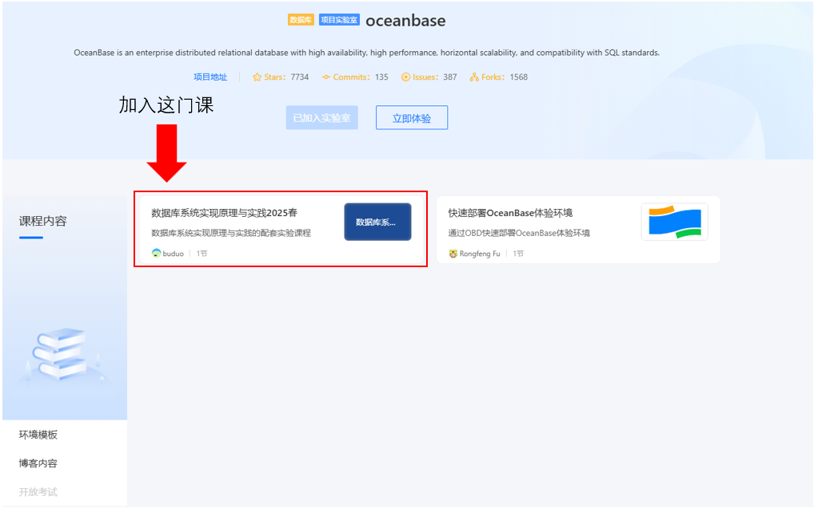
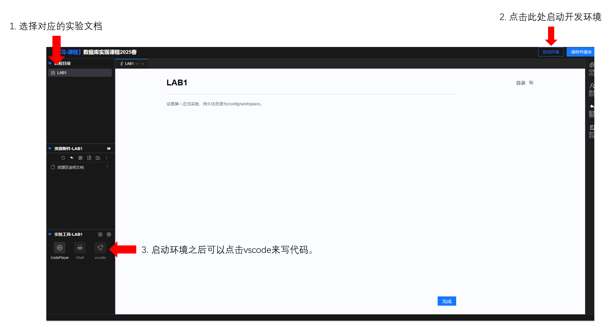
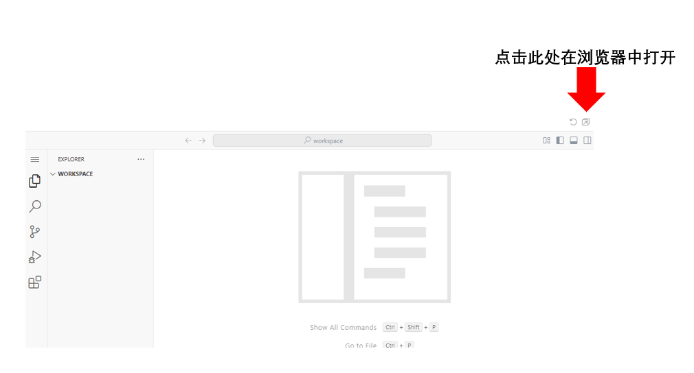
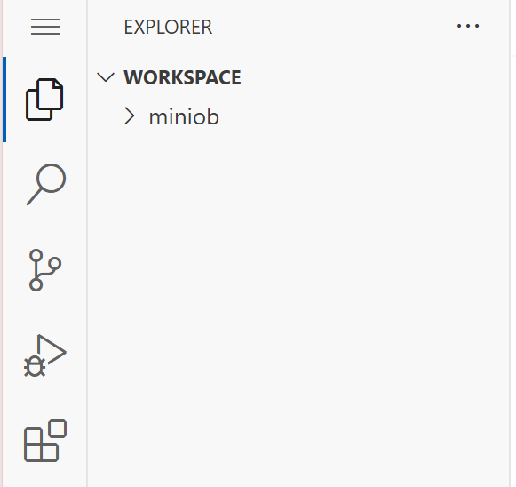
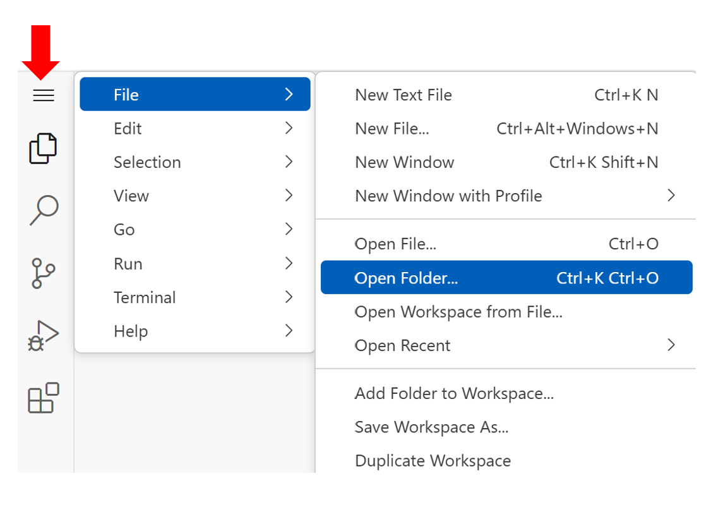
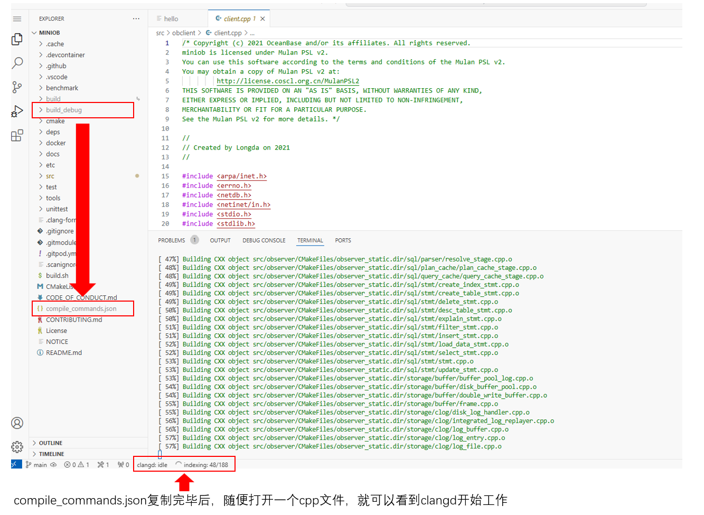

# 开源学堂在线编程环境开发 MiniOB 

## 加入课程
加入课程链接: [数据库系统实现原理与实践2025春](https://t.cloudlab.top/labAdminRegister-oceanbase/1aEaMb)

如下图加入课程：



## 初始化代码环境

### 初始化项目代码
1. 进入课程学习界面后，大家可以在左侧课程目录中找到对应的实验，然后点击对应的目录项，查看对应的实验的文档。

2. 点击上方`启动环境`即可启动开发环境，每次实验的开发环境中的内容是会持久化保存在云端。

3. 点击实验工具中的`vscode`来进行开发，将项目在浏览器中打开。


4. 点击在浏览器中打开，单独打开一个网页作为开发页面。


5. `vscode`中只提供了开发环境，需要同学们从[https://github.com/oceanbase/miniob](https://github.com/oceanbase/miniob)中将项目克隆到环境中。使用下面命令将项目`clone`下来之后:`git clone https://github.com/oceanbase/miniob.git`，可以看到在`workspace`下面有一个`miniob`的文件夹。

6. 现在将`vscode`的工作目录设置成`miniob`文件夹，从左侧栏中打开`miniob`的文件夹即可，如下图。


#### 开发环境配置
1. 首先安装插件`clangd`和`C/C++ Debug`。
安装`clangd`,

同样的方式安装`C/C++ Debug`。

2. 修改好代码之后，`Ctrl+Shift+B`构建项目，构建完毕后有一个`build_debug`的文件夹，存放编译后的可执行文件。
3. 使用`clangd`作为语言服务器， 构建完毕后，将`build_debug`中的`compile_commands.json`文件复制到`miniob`目录中，随便打开一个cpp文件，就可以看到`clangd`开始工作。

4. 用`F5`进行调试，关于如何`vscode`如何调试，可以参考相关的资料:[cpp-debug](https://code.visualstudio.com/docs/cpp/cpp-debug)。修改`launch.json`文件中`program`和`args`来调试不同的可执行文件。


## 提交作业
实验课作业使用提交平台进行提交，提交平台：[OceanBase训练营](https://open.oceanbase.com/train?questionId=200001)

训练营提交代码需要gitee/github的仓库，并且大家创建的仓库必须是设置为**私有仓库**（否则会提交失败），具体教程可以参考下面链接：

[MiniOB GitHub 在训练营中的使用说明](https://oceanbase.github.io/miniob/game/github-introduction/)

[MiniOB Gitee 在训练营中的使用说明](https://oceanbase.github.io/miniob/game/gitee-instructions/)

点击立即提测，填入对应的仓库代码地址，`Commit id`和分支，就可以进行测试，并且可以看到测试结果。

## 注意事项
1. 注意在线平台的实验时长的限制，到达限制之后会*回收当前环境*，但是**在持久化目录下的文件不会被清理，会持久保存**，就是上文提到的`workspace`下的文件。注意如果需要`debug`，一定要注意剩余环境时长。
2. 需要及时将代码上传到`github/gitee`上避免丢失代码。
3. 共有5个实验，实验文档会持续更新。
4. MiniOB的资料：[MiniOB](https://oceanbase.github.io/miniob/)
## 可能会出现的问题
出现了问题请先查看相关文档，对于一些文档中没有出现的异常提示/报错可以上网搜索，查询资料然后再可以问问助教，同学和老师。

### Github的网络没有问题，但是push代码失败
1. 使用令牌来做Github的身份验证，详细参考：
[管理个人访问令牌](https://docs.github.com/en/authentication/keeping-your-account-and-data-secure/managing-your-personal-access-tokens)

2. 按照上述步骤获得`token`之后，并且按照上文步骤中，导入`miniob`仓库在自己的`github`账号中。

3. 在终端中输入下面命令。
```
 # 先删除远端origin对应的仓库的本地记录。
 git remote rm origin
 # 添加自己的仓库，按照下面格式，其中 <token>替换成自己的token, <username>替换成自己的用户名。
 git remote add origin https://<token>@github.com/<username>/miniob.git
```
4. 然后就可以进行正常的推送和拉取操作了。
