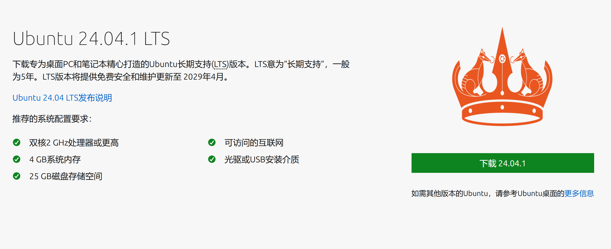
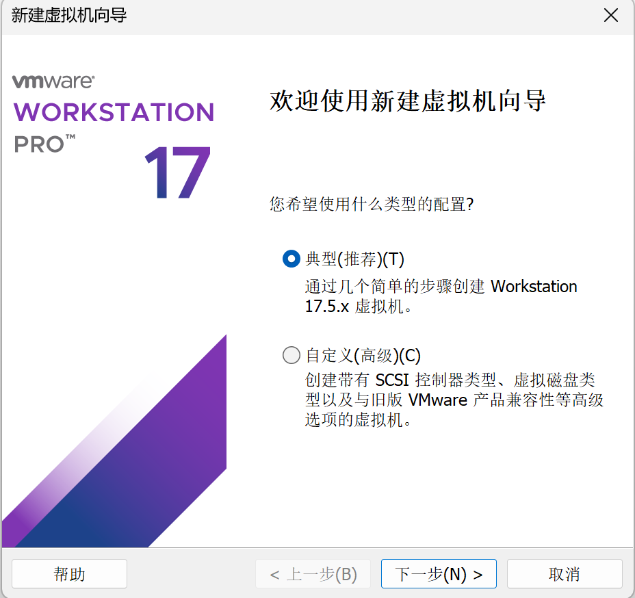
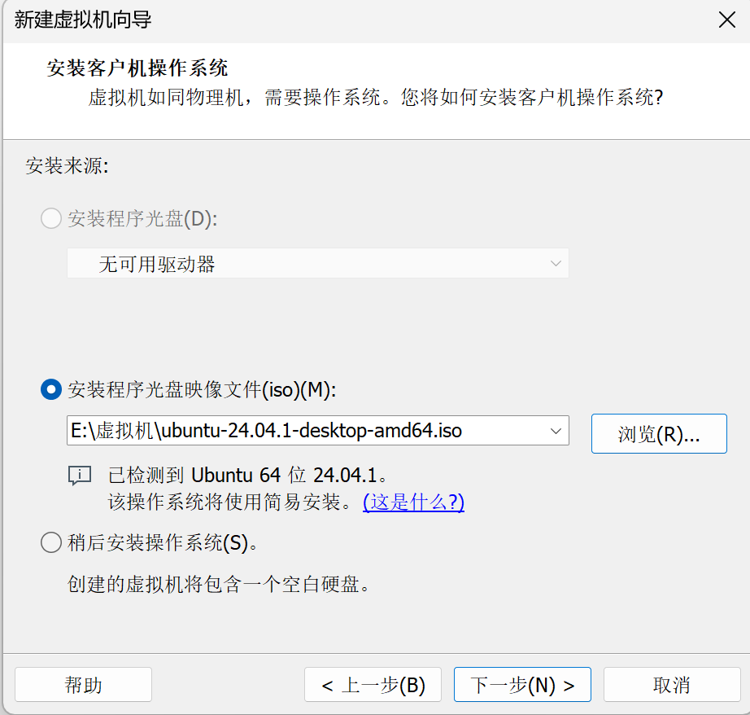
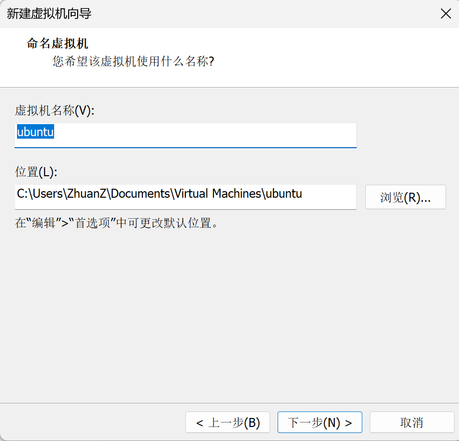
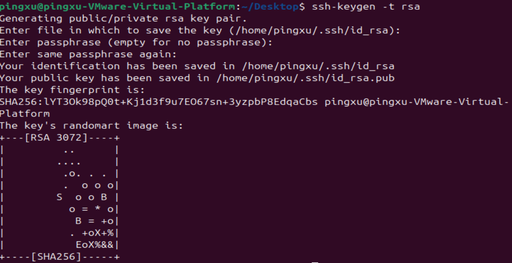
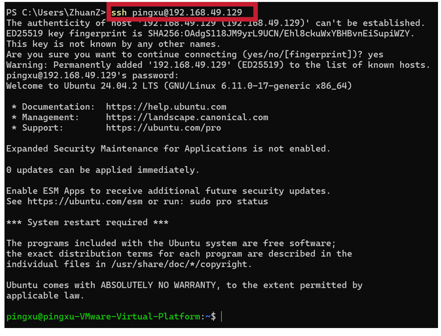
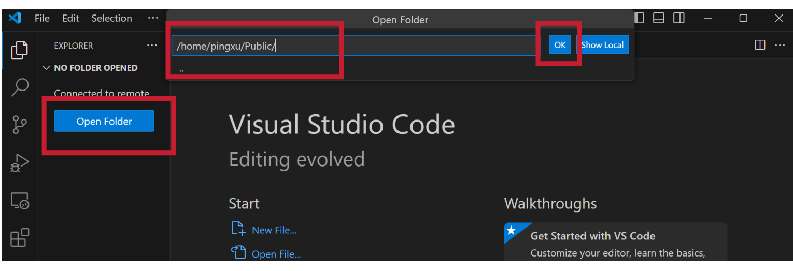
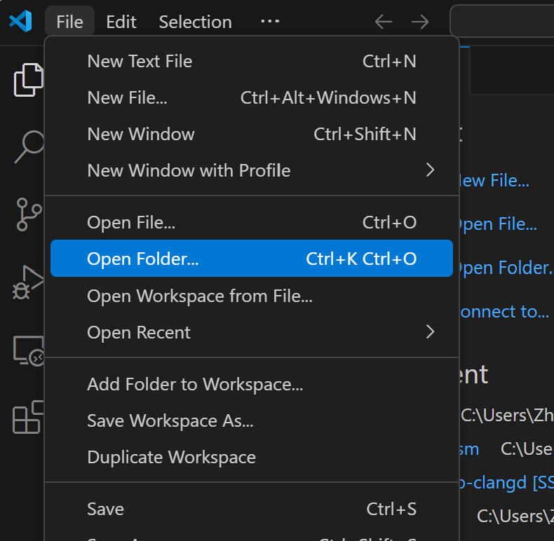

# 虚拟机+`vscode remote`开发
作者：徐平 数据科学与工程学院 华东师范大学 

#### 1. 安装Ubuntu
Ubuntu下载地址：[下载](https://cn.ubuntu.com/download/desktop)

点击下载



选择典型的类型配置，点击下一步



找到刚刚从网站下载的iso文件，点击下一步



设置名称和密码


设置虚拟机名称和虚拟机数据存放位置



设置磁盘大小，推荐40~80G，点击下一步


点击完成即可


虚拟机开机之后，不断点击`Next`即可, 注意这里选择`Install Ubuntu`，后续操作也是不断点击`Next`。


输入账号名和密码


后续就点击`Next`，最后安装`Ubuntu`，等待安装`Ubuntu`完毕，安装完毕之后点击`Restart Now`即可。

#### 2. 配置环境
登录，进入终端，输入以下命令:
1. 安装网络工具
```
sudo apt update && sudo apt -y upgrade
sudo apt install -y net-tools openssh-server
```
2. 输入命令`ssh-keygen -t rsa`，然后一路回车，生成密钥。 

3. 然后检查`ssh`服务器的状态，输入命令：`sudo systemctl status ssh`或`sudo systemctl status sshd`

**注意这里可能出现的错误**：
* 上图中绿色的`active`状态是红色的，表示`sshd`没有启动，使用命令`sudo systemctl restart ssh`或者`sudo systemctl restart sshd`。
* `systemctl`找不到`sshd`/`ssh`服务，这里可以尝试输入下面两个命令:`ssh-keygen -A`和`/etc/init.d/ssh start`，然后再去查看服务器状态。


4. 安装完毕之后，输入`ifconfig`查看虚拟机`ip`

5. 然后就可以在本地终端使用`ssh`命令连接虚拟机服务器。
   `ssh <用户名>@<上图操作中的ip地址>`

6. 安装`vscode`:[vscode下载地址](https://code.visualstudio.com/download)
7. 安装`ssh remote`插件

8. 配置插件,添加刚刚的虚拟机

9. 输入连接虚拟机的命令，如下图示例

10. 打开一个新的远程文件夹：
    
11. 选择一个文件夹作为开发文件夹，这里我选择`/home/pingxu/Public/`

进入新的文件夹之后，输入完密码，会问是否信任当前目录什么的，选择`yes`就行了，自此，现在虚拟机安装完毕，工作目录是`/home/pingxu/Public/`。
#### 3. 安装必要软件
`vscode`中`crtl`+`~`打开终端，直接把下面命令拷贝过去
```
sudo apt-get update && sudo apt-get install -y locales apt-utils && rm -rf /var/lib/apt/lists/* \
    && localedef -i en_US -c -f UTF-8 -A /usr/share/locale/locale.alias en_US.UTF-8
sudo apt-get update \
    && sudo apt-get install -y build-essential gdb cmake git wget flex texinfo libreadline-dev diffutils bison \
    && sudo apt-get install -y clang-format vim
sudo apt-get -y install clangd lldb
```
#### 4. 安装miniob
```
# 从github克隆项目会遇到网络问题，配置网络代理命令
git config --global http.proxy http://<代理ip>:<代理端口>
git config --global https.proxy https://<代理ip>:<代理端口>
```
在`Public`目录下：
```
git clone https://github.com/oceanbase/miniob 
cd miniob
THIRD_PARTY_INSTALL_PREFIX=/usr/local bash build.sh init 
```
完毕之后，我们用`vscode`打开`miniob`，作为新的工作目录。




#### 5. vscode插件配置
1. 首先安装插件`clangd`和`C/C++ Debug`。
安装`clangd`,


同样的方式安装`C/C++ Debug`。


1. 修改好代码之后，`Ctrl+Shift+B`构建项目，构建完毕后有一个`build_debug`的文件夹，存放编译后的可执行文件。
2. 使用`clangd`作为语言服务器， 构建完毕后，将`build_debug`中的`compile_commands.json`文件复制到`miniob`目录中，随便打开一个cpp文件，就可以看到`clangd`开始工作。
   


#### 6. debug简单教程
 用`F5`进行调试，关于如何`vscode`如何调试，可以参考相关的资料:[cpp-debug](https://code.visualstudio.com/docs/cpp/cpp-debug)。修改`launch.json`文件中`program`和`args`来调试不同的可执行文件。
   


