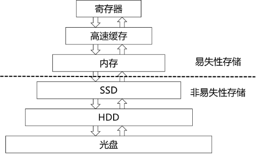
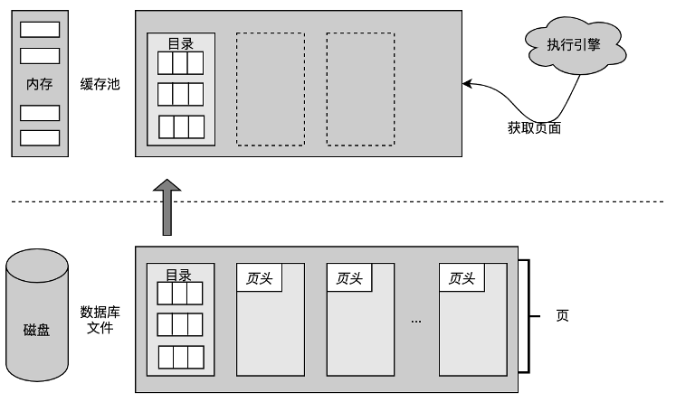
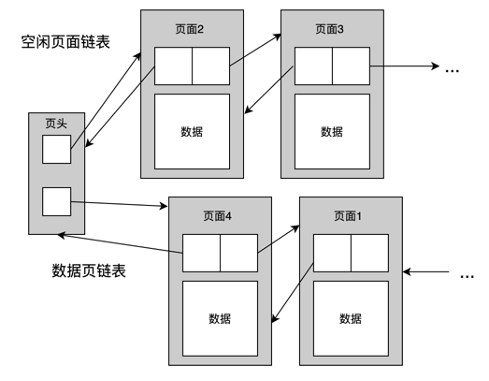
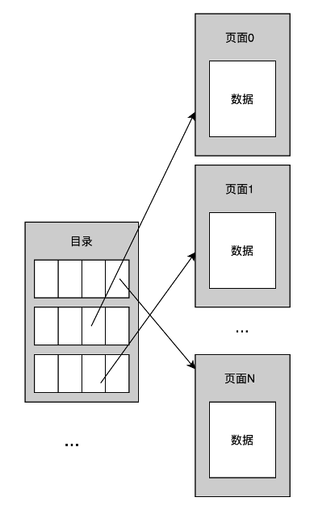
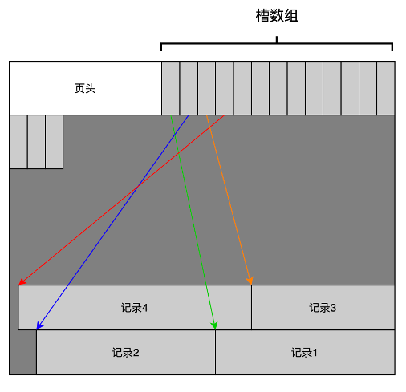
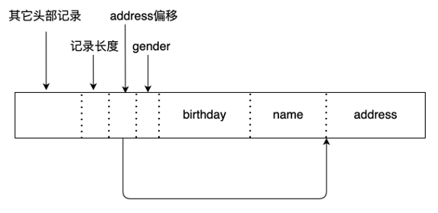
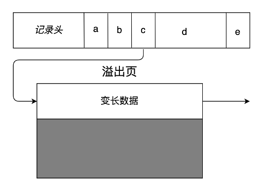
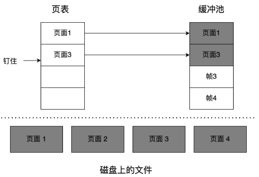

# 第2章 数据库的存储结构

## 2.1 存储设备概述

大多数计算机系统中都存在多种数据存储类型，根据不同存储介质的速度和成本，可以把它们按层次结构组织起来，如图2-1所示。位于顶部的存储设备是最接近CPU的，其存取速度最快，但是容量最小，价格也最昂贵。离CPU越远，存储设备的容量就越大，不过速度也越慢，每比特的价格也越便宜。

图2-1 存储设备层次结构图

按其存储数据的持久性，可将存储设备分为易失性存储和非易失性存储两类。

- **易失性存储：** 易失性意味着当机器掉电时存储介质中的数据会丢失。易失性存储支持随机字节寻址方式，程序可以跳转到任意字节地址并获取数据。易失性存储通常指的是内存。
- **非易失性存储：** 非易失性是指存储设备不需要通过连续供电来保证其存储的数据不丢失。非易失性存储设备是块寻址的，这意味着为了读取该设备中特定偏移位置上的一个值，必须先将包含这个值的一个块的数据加载到内存中。非易失性存储设备虽然也支持随机存取，但通常在顺序访问时（即同时读取多个连续块时）性能表现更好。目前常见的非易失性存储有固态硬盘（SSD）和机械硬盘（HDD），在本教程中不刻意区分，统称为磁盘。

除了上述存储设备，目前还有一种称为持久内存（persistent memory）的新型存储设备。持久内存既有内存的高速性，又有磁盘的持久性，兼具双重优势，不过这类设备不在本教程的讨论范围内。

## 2.2 面向磁盘的DBMS概述

根据数据库的主存储介质的不同，DBMS可分为面向磁盘（disk-oriented）和面向内存（memory-oriented）两种体系结构，本教程重点介绍经典的面向磁盘的体系结构。这种体系结构的特点是，为了保证在系统发生故障时的数据持久化，数据库使用非易失的磁盘作为主存储介质，但是由于系统不能直接操作磁盘上的数据，因此还需使用易失的内存作为缓存。众所周知，相对于内存，磁盘的访问速度非常慢，因此在面向磁盘的DBMS中，需要重点考虑的一个问题就是，如何在磁盘和内存之间交换数据才能减少磁盘I/O带来的性能延迟。

图2-2 面向磁盘的DBMS

面向磁盘的DBMS的存储架构如图2-2所示。DBMS将数据库映射到文件中，这些文件由底层操作系统维护，永久存储在磁盘上。因为文件存取是操作系统提供的基本功能，所以我们默认文件系统总是作为DBMS的基础而存在的。主流操作系统提供的通常为无结构的流文件，DBMS会将每个文件再划分为固定大小的数据块，称为页（page）。页是DBMS在磁盘和内存间交换数据的基本单元。

如果需要对数据库进行读写操作，DBMS需要先将数据从磁盘读取到内存中的缓冲池内，缓冲池管理器负责在磁盘和内存之间以页为单位进行数据交换。DBMS的执行引擎在语句处理过程中需要使用某个数据页时，会向缓冲池提出请求，缓冲池管理器负责将该页读入内存，并向执行引擎提供该页在内存中的指针。当执行引擎操作那部分内存时，缓冲池管理器必须确保该页面始终驻留在那片内存区域中。

## 2.3 文件的组织结构

### 2.3.1文件的分页

DBMS最常见的做法是将数据库以文件的形式存储在磁盘上。有些DBMS可能使用一组文件来存储数据库，有些DBMS可能只使用单个文件。

从操作系统的角度来看，一个文件就是一个字节流序列，操作系统并不关心和了解文件的内容以及文件之间的关联性。数据库文件的内容只有创建它的DBMS才知道如何解读，因为它是由DBMS以其特定的方式来组织的。

数据库文件的组织和管理由DBMS的存储管理器负责，它将文件划分为页面的集合，并且负责跟踪记录这些页面的使用情况，包括哪些页面存储了什么数据，哪些页面是空闲的等等。页面中可以存储不同类型的数据，比如记录、索引等，但是DBMS通常不会将不同类型的数据混合存储在同一个页面中。

### 2.3.2 页的标识

每个页面都有一个唯一的标识符。如果数据库是单个文件，那么页面ID可以直接映射为文件内的偏移量；如果数据库包含多个文件，则还需加上文件标识符来进行区分。大多数DBMS都有一个间接层，能够将页面ID映射为文件路径和偏移量。系统上层模块请求一个页面时，先给出页面ID，存储管理器将该页面ID转换为文件路径和偏移量，并由此定位到对应页面。

### 2.3.3 页的大小

大多数DBMS使用固定大小的页面，因为支持可变大小的页面会带来很多麻烦。例如，对于可变大小的页面，删除一个页面可能会在数据库文件中留下一个空缺，而由于页面的大小不等，这个空缺位置很难被一个新页填满，从而导致碎片问题。

大多数数据库默认使用4~8KB的页大小，但是许多数据库允许用户在创建数据库实例时自定义页的大小。

需要注意区分以下两个关于页的概念:

- **硬件页：** 即磁盘块，大小通常为4 KB，是磁盘I/O的基本单位。
- **数据库页：** 大小通常为磁盘块大小的整数倍，是DBMS在磁盘和缓冲池之间交换数据的基本单位。

二者的区别在于，对硬件页的写操作是原子的，但是对数据库页的写操作则不一定。换言之，如果硬件页的大小为4KB，那么当系统尝试向磁盘写入一个硬件页时，这4KB数据要么全部写入，要么全部不写入，这一点是由存储设备来保证的。但是，如果数据库页大于硬件页，那么DBMS对一个数据库页的写操作将被操作系统分解为对多个硬件页的写操作，此时DBMS必须采取额外措施来确保数据被安全地写入磁盘，因为系统可能会在将一个数据库页写入到磁盘的过程中发生崩溃，从而导致该数据库页的内容出现不一致性错误。

### 2.3.4 堆文件

关系是记录的集合，这些记录在数据库文件中可以有多种组织方式：

- **堆文件组织（ heap file organization）** ：堆文件是页的无序集合，记录在页中以随机的顺序存储。即，一条记录可以放在文件中的任何地方，只要那里有足够的空间存放这条记录，记录间不用考虑先后顺序的。 通常每个关系使用一个单独的堆文件。
- 顺序文件组织（sequential file organization）：记录根据其&quot;查找键&quot;的值顺序存储。
- **散列文件组织（ hash file organization）** ：在每条记录的某个/些属性上计算一个散列函数，根据散列的结果来确定将记录放到文件的哪个页面中。

在本节中，我们重点介绍堆文件的组织方式。由于这种组织方式并不关心记录间的顺序，因此DBMS只需要登记堆文件中哪些页面中是存储了数据的（数据页），哪些页面是空闲的（空闲页）。具体可以采用以下两种表示形式：

- 链表：以链表的形式将文件中的空闲页和数据页分别勾连起来，并在文件的首页维护两个指针，分别指向空闲页链表和数据页链表的第一个页面，如图2-3所示。这种方式下，如果想要找到一个特定的数据页，需要从链首开始逐个扫描链表中的页面，直到找到为止，I/O开销较大。
- 页目录：维护一种特殊的页面（目录页），在该页中记录每个数据页的位置以及该数据页中剩余的空闲空间大小，如图2-4所示。页目录将页面的状态信息集中存放在一起，可以提高查找特定页面的速度。

图2-3 链表表示法

图2-4 页目录表示法

## 2.4 页的组织结构

一个页面的内部结构可以粗略的划分为两部分：

- **页头** ：页头登记了关于页面内容的元数据，如页面大小、校验和、DBMS版本、事务可见性、压缩信息等。有些系统（如Oracle）要求页面是自包含的，即关于该页的所有描述信息都可以在该页面中找到。
- **数据区** ：存放数据的区域。这里我们只讨论如何在数据区中存放记录。目前DBMS中最常用的方法是采用槽式页面。这种方法将数据区划分为一个个插槽（slot），每个插槽中放置一条记录。

注意，本节的讨论基于以下限制条件：（1）不存在整个数据区放不下单条记录的情况；（2）一条记录必须包含在单个页面中，换言之，没有哪条记录是一部分包含在一个页面中、一部分包含在另一个页面中的（第5节讨论的溢出页除外），这个限制可以简化并加速数据访问。

### 2.4.1 槽式页面

在槽式页面结构中，为了登记当前页面中有多少条记录以及每条记录的位置，必须在页头中维护以下信息：

1. 本页中已使用的槽的数量；
2. 最后一个已使用的槽的起始位置；
3. 一个槽数组，登记本页中每个记录的起始位置。

如果允许记录是变长的，我们一开始并不能确定一个页面中能存放多少条记录，因此也就无法确定槽数组的最大长度，也就是说页头所占的区域大小是不确定的。因此比较合理的做法是，向页中插入记录时，槽数组从前向后增长，而被插入的记录数据则是从页尾向前增长。当槽数组和记录数据相遇时，则认为该页面是满页。槽式页面的布局示意图如图2-5所示。

图2-5 槽式页面的布局

### 2.4.2 插入记录

向关系中插入一条记录时，对于堆文件，只需要找到一个有足够空闲空间能放得下这条记录的页面，或当所有已分配页面中都没有足够空闲空间时，就申请一个新的空闲页，然后将记录放置在那里。

### 2.4.3 删除记录

从页中删除记录时，需要考虑如何回收该记录的空间。

一种方法是在页内滑动记录，使得记录间没有空隙，从而保证页面中未使用的区域一定位于槽数组和已使用区域之间，图2-5表示的就是这种方式。

如果不滑动记录，则需要在页头维护一个空闲区列表，以保证当向页中插入一条新记录时，我们能知道该页中的空闲区在哪里，有多大。当然，页头通常不必存储全部空闲区列表，只存列表的链头就够了，然后可以使用空闲区自身的空间存储下一个空闲区的信息。

### 2.4.4 修改记录

如果修改的是定长记录，对页面存储没有影响，因为修改后记录占用的空间与修改前完全相同。但是如果修改的是变长记录，就会碰到与插入和删除类似的问题。

如果修改后的记录比其旧版本长，则我们需要在当前页面中获得更多的空间，这个过程可能涉及记录的滑动。如果当前页面中的空闲区域不够，还需要将记录移动到其他页面。反之，如果记录由于修改而变短，我们可以像删除记录时那样回收其释放的空间。

## 2.5 记录的组织结构

记录本质上就是一个字节序列，如何将这些字节解释为属性类型和值是DBMS的工作。与页面结构类似，记录内部结构也可以分为两部分：

- **记录头** ：存放关于记录的元数据，例如DBMS并发控制协议的可见性信息（即哪个事务创建/修改了此记录的信息）、NULL值的位映射等。注意，关于数据库模式的元数据没有必要存储在记录头里。
- **记录数据** ：包含记录中各个属性的实际数值。如前所述，大多数DBMS不允许记录的长度超过页面的大小，且一个页面中一般只存放同一个关系的记录。

### 2.5.1 定长记录

定长记录全部由定长字段组成，是最简单的记录组织形式。定长记录的插入和删除是比较容易实现的，因为被删除的记录留出的可用空间恰好是插入新的记录所需要的空间。

定长记录在组织时需要注意的一个问题是内存对齐问题。很多处理器需要在数据的开始地址为4或8的倍数时才能实现更高效的内存读写，所以DBMS在组织记录数据时通常会根据情况使所有字段的起始地址是4或8的倍数。采用这种做法时，一个字段前可能会存在一些没有被上一个字段使用的空间，这些空间其实是被浪费掉了。但尽管如此，这样做还是有必要的。因为记录虽然是存放在磁盘而不是内存中，但是对记录的操作仍需在内存中进行，所以在组织记录时需要考虑如何让它在内存能够被高效访问。

### 2.5.2 变长记录

变长记录允许记录中存在一个或多个变长字段。由于变长字段在记录中的偏移位置是不确定的，因此记录中必须包含足够多的信息，让我们能够方便地提取记录的任何字段。变长记录的实现可以采用以下两种方法。

一种简单有效的实现方法，是将所有定长字段放在变长字段之前，然后在记录头写入以下信息：（1）记录长度；（2）除第一个变长字段之外的所有变长字段的偏移位置。之所以不需要存第一个变长字段的偏移位置，是因为我们知道第一个变长字段就紧跟在定长字段之后。一个变长记录的例子如图2-6所示，该记录共包含四个字段，其中有两个变长字段：name和address。

图2-6 变长记录表示方法一示例

变长记录的另一种表示方法是保持记录定长，将变长部分放在另一个溢出页中，而在记录本身存储指向每一个变长字段开始位置的指针，如图2-7所示。

图2-7 用溢出页存放变长字段

这种方法的好处是可以保持记录定长，能够更有效地对记录进行搜索，记录也很容易在页内或页间移动。但是另一方面，将变长部分存储在另一个页中，增加了为检索一条记录的全部数据而需要进行的磁盘I/O次数。

溢出页不仅可以存储变长字段，还可以用于存储大值数据类型的字段，比如TEXT和BLOB字段，这些数据往往需要使用多个页面来存储。

## 2.6 缓冲池管理

面向磁盘的DBMS的一个主要目标就是尽量减少磁盘和内存之间传输的页面数量。减少磁盘访问次数的一种方法是在内存中保留尽可能多的页面，理想情况下，要访问的页面正好都已经在内存中了，这样就不再需要访问磁盘了。

但是在内存中保留所有的页面是不可能的，所以就需要有效地管理内存中用于缓存页面的空间，尽可能提高页面在内存中的命中率。用于缓存页面的那部分内存空间称为缓冲池，负责缓冲池空间分配的子系统称为缓冲池管理器。

### 2.6.1 缓冲池结构

缓冲池本质上是在DBMS内部分配的一大片内存区域，用于存储从磁盘获取的页面。这片内存空间被组织为一个数组，其中每个数组项被称为一个帧（frame），一个帧正好能放置一个页面。当一个页面被请求时，DBMS首先搜索缓冲池，如果在缓冲池中没有找到该页，就从磁盘获取该页的副本，并放置到缓冲池的一个帧中。缓冲池的组织结构如图2-8所示。

图2-8 缓冲池组织结构

为了有效和正确地使用缓冲池，缓冲池管理器必须维护一些元数据。

页表是一个内存哈希表，用于登记当前已经在内存中的页面的信息。页表将页面ID映射到缓冲池中一个帧的位置。因为缓冲池中页面的顺序不一定反映磁盘上的顺序，所以需要通过这个额外的数据结构来定位页面在缓冲池中的位置。

除了保存页面的内存地址，页表还为每个页面维护一个脏标志和一个引用计数器。

- 脏标志：脏标志由线程在修改页面时设置。如果一个页面被设置了脏标志，就意味着缓冲池管理器必须将该页写回磁盘，以保证磁盘上的页面副本包含最新的数据。
- 引用计数：引用计数表示当前访问该页（读取或修改该页）的线程数。线程在访问该页之前必须增加引用计数。如果页的引用计数大于零，说明该页面正在被使用，此时不允许缓冲池管理器从内存中淘汰该页。

关于缓冲池中的内存空间如何分配的问题，缓冲池管理器可采取两种策略：

- 全局策略：有利于当前整体工作负载的策略。全局策略综合考虑所有活动事务，以找到分配内存的最佳方案。
- 本地策略：以保证单个查询或事务运行得更快为目标的策略。本地策略将一个帧分配给特定事务时，不考虑其他并发事务的行为，即使这样可能对整体工作负载不利。

### 2.6.2 缓冲池替换算法

与其他应用程序一样，DBMS对数据库文件的读写操作都需要通过调用操作系统的接口来实现。通常，为了优化I/O性能，操作系统自身也维护了一个缓冲区来缓存从磁盘读入的数据块。这个缓冲区和DBMS的缓冲池在功能上显然是重复的，会导致同一个数据库页面的数据在内存中的冗余存储，而且操作系统缓冲区的管理策略还使得DBMS难以控制内存与磁盘之间的页面交互。因此，大多数DBMS都使用直接I/O绕过操作系统的缓存。

当DBMS需要释放一个帧来为新的页面腾出空间时，它必须决定从缓冲池中淘汰哪个页面，这取决于DBMS采用的缓冲池替换算法。替换算法的目标是提高正确性、准确性、速度和元数据开销。需要注意的是，引用计数大于零的页面是不能淘汰的。

常用的替换算法有最近最少使用（LRU）算法和时钟（CLOCK）算法。

- LRU算法：LRU算法为每个页面维护其最后一次被访问的时间戳，这些时间戳可以存储在一个单独的数据结构（如队列）中，以便对其进行排序来提高效率。需要淘汰页面时，DBMS总是选择淘汰时间戳最早的页面。
- CLOCK算法：CLOCK算法是一种近似LRU算法，它不需要每个页面都有单独的时间戳，而是为每个页面维护一个引用位。当某个页面被访问时，就将它的引用位的值置为1。想象页面被组织在循环缓冲区中，需要选择淘汰页面时，有一个&quot;时钟指针&quot;在循环缓冲区中扫描，检查页面的引用位是否为1。如果是，则将引用位重新置0并移动指针到下一个页面；否则，淘汰当前页面。

LRU算法和CLOCK算法应用于DBMS的缓冲池管理时存在许多问题。比如顺序扫描时，LRU和CLOCK容易使缓冲池的内容出现顺序溢出问题。因为顺序扫描会依次读取每个页面，所以读取页面的时间戳并不能反映我们实际想要哪些页面。换句话说，最近使用的页面实际上是最不需要的页面。

有三种解决方案可以解决LRU和CLOCK算法的缺点。

第一种解决方案是LRU-K，它会以时间戳的形式登记最后K次引用的历史，并计算连续引用之间的时间间隔，将此历史记录用于预测页面下一次被访问的时间。

第二种解决方案是对每个查询进行局部化，DBMS在每个查询的局部范围内选择要淘汰的页面，这样可以最小化每个查询对缓冲池的污染。

最后一种解决方案是优先级提示，它允许事务在查询执行期间根据每个页面的上下文，告诉缓冲池管理器该页面是否重要。

在淘汰页面时，对于脏页可以有两种处理方法：（1）总是优先淘汰缓冲池中的非脏页面；（2）先将脏页写回磁盘以确保其更改被持久化，然后再将其淘汰。后者会降低替换页面的速度；而前者虽然速度快，但是有可能将未来不会被再次访问的脏页留在缓冲池。

避免在淘汰页面时执行页面写出操作的一种方法是后台写。采用这种方法的DBMS会定期遍历页表并将脏页写入磁盘。当脏页被安全写入磁盘后，将该页面的脏标志重新置零。

### 2.6.3 缓冲池的优化

有许多方法来优化缓冲池，使其适合应用程序的工作负载。

（1）多缓冲池

DBMS可以维护多个用于不同目的的缓冲池，比如每个数据库使用一个缓冲池，每种页面类型使用一个缓冲池。然后针对其中存储的数据的特点，每个缓冲池可以采用量身定制的管理策略。

将所需页面映射到缓冲池有两种方法：对象ID和散列。对象ID这种方法需要扩展元数据，使其包含关于每个缓冲池正在管理哪些数据库对象的信息，然后通过对象ID，就可以实现从对象到特定缓冲池的映射。另一种方法是散列，DBMS散列页面ID以选择访问哪个缓冲池。

（2）预取

DBMS还可以根据查询计划通过预取页面来进行优化。然后，在处理第一组页面时，系统可以将第二组页面预取到缓冲池中。这种方法通常在顺序访问多个页面时使用。

（3）扫描共享

查询游标可以重用从磁盘读入的数据或操作符的计算结果。这种方法允许将多个查询附加到扫描表的单个游标上。当一个查询开始扫描时，如果已经有另一个查询在扫描，DBMS会将第一个查询附加到第二个查询的游标上。DBMS登记第二个查询加入时的位置，以便在到达数据结构末尾时结束扫描。

（4）缓冲池旁路

为了避免开销，顺序扫描操作符不会将获取的页存储在缓冲池中，而是使用正在运行的查询的本地内存。如果操作符需要读取磁盘上连续的大量页序列，那么这种方法可以很好地工作。缓冲池旁路也可以用于临时数据，如排序、连接。

### 2.6.4 其他内存池

除了元组和索引，DBMS还需要内存来存放其他东西。这些内存池中的内容可能并不总是来自磁盘或者需要写入磁盘，具体取决于实现。

- 排序+连接缓冲区
- 查询缓存
- 维护缓冲区
- 日志缓冲区
- 字典缓存

